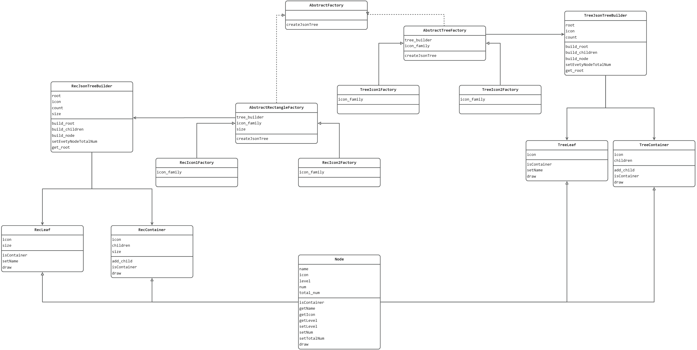
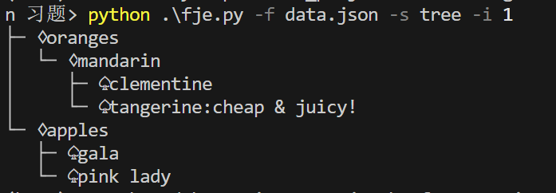
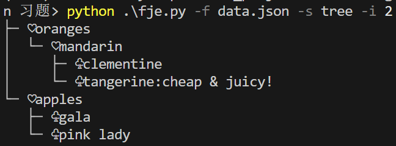
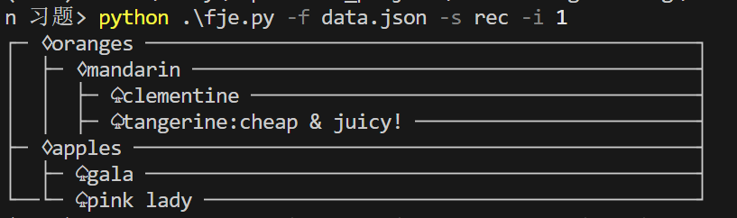
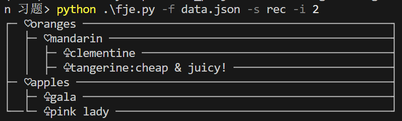

# Funny JSON Explorer说明文档

> Mengke Huang 21307268

### 一、类图

- 

- 抽象工厂模式：抽象工厂`AbstractRectangleFactory`能够生产JsonTree, 由`Node`构成。具体工厂`RecIcon1Factory`和具体工厂`RecIcon2Factory`是其泛化，生产不同icon的具体产品`RecContainer`（即中间节点）和`RecLeaf`（即叶子节点）, 二者是抽象产品`Node`泛化。另一抽象工厂`AbstractTreeFactory`同理。不同抽象工厂生产的节点风格不同。

- 建造者模式：抽象工厂`AbstractRectangleFactory`用建造者`RecJsonTreeBuilder`生成每个节点，构建JsonTree。另一抽象工厂同理。

- 组合模式：JsonTree由中间节点`RecContainer`和叶子节点`RecLeaf`构成，中间节点拥有子节点。另一风格的节点同理。

### 二、结果展示

- 

- 

- 

- 
