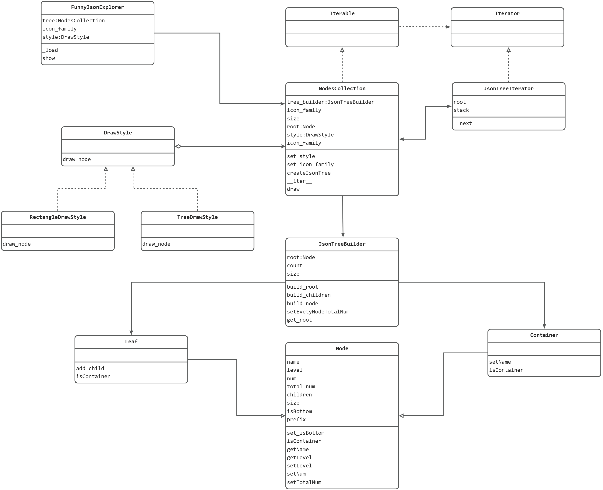
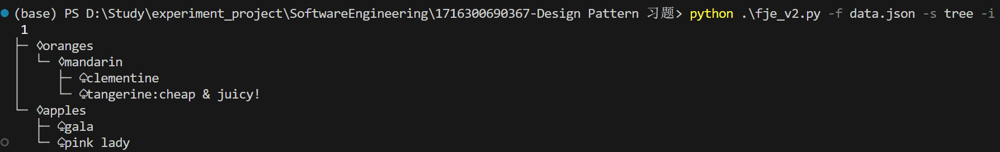
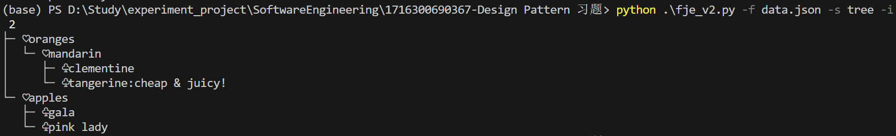
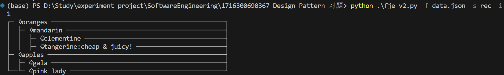
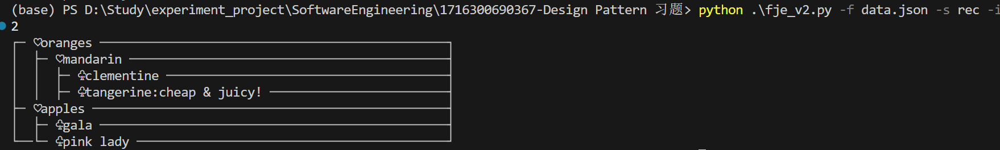

# Funny JSON Explorer v2说明文档

> Mengke Huang 21307268

### 一、类图

- 迭代器模式：`JsonTreeIterator`为具体迭代器，`NodesCollection`为具体集合

- 策略模式：`DrawStyle`为策略接口；`RectangleDrawStyle`和`TreeDrawStyle`是具体策略，用于绘制节点；`NodesCollection`为上下文，维护具体策略的引用

### 二、结果展示

